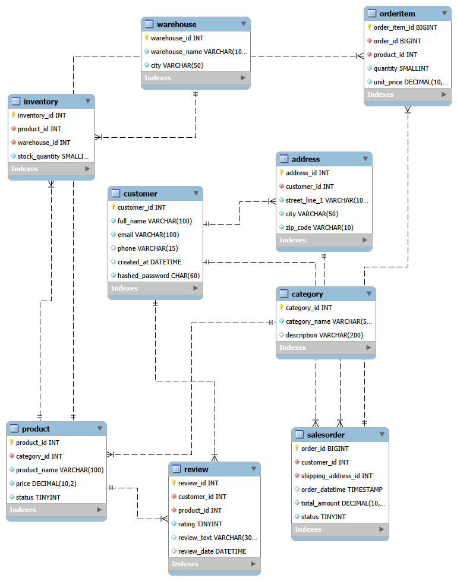

# Amazon_DBMS_Group18_341005_341041_341043
Database design and implementation for Amazon using MySQL (DBMS Project)

  

## EER Diagram

Amazon E-Commerce Database Management System

This project presents a structured and normalized database design for an Amazon-inspired e-commerce platform. It demonstrates the practical application of core DBMS concepts such as entity-relationship modeling, normalization to 3NF, and enforcement of relational integrity through primary and foreign keys.

Objectives of the Project
To model a complex, real-world retail environment using a relational database.

To reduce data redundancy through strict normalization.

To ensure transactional integrity using primary keys, foreign keys, and unique constraints.

To support efficient storage and retrieval for high-volume order processing.

To demonstrate forward engineering and schema design using MySQL Workbench.

Key Features
Centralized Customer Management: Unified profiles for users with secure credential handling.

Dynamic Order Tracking: Full lifecycle management from order placement to shipping status.

Inventory & Warehouse Control: Multi-location stock tracking for a diverse product catalog.

Categorized Product Catalog: Simplified product discovery through hierarchical categorization.

Review & Feedback Loop: Integrated system for customer-driven product ratings.

Major Entities
Customer: Stores personal profiles and authentication details (e.g., email, hashed passwords).

SalesOrder: Records individual transactions, order timestamps, and total amounts.

Address: Manages multiple shipping and billing locations for customers.

Product: Maintains the global catalog of items, pricing, and descriptions.

Inventory: Tracks the physical stock quantities mapped across different warehouses.

OrderItem: Acts as a bridge table to link specific products and quantities to a single order.

Relationship Handling & Integrity
One-to-Many Relationships: A single customer can have multiple addresses and place multiple orders.

Many-to-Many Bridge: The inventory table manages the complex relationship between products and various warehouse locations.

Normalization: High-level entities like Category and Address are separated to maintain 3NF and prevent update anomalies.

Referential Integrity: Enforced through ON DELETE RESTRICT to protect historical order data and ON UPDATE CASCADE for synchronized IDs.

Optimized Data Types: Use of BIGINT for high-volume order IDs, DECIMAL(10,2) for financial precision, and TINYINT for statuses and ratings to optimize storage.

Tools and Technologies Used
MySQL Workbench 8.0: Used for EER modeling and forward engineering the schema.

MySQL Server 8.0: The target relational database engine for data storage and querying.

SQL DDL/DML: Implementation of structured queries for table creation and sample data insertion.

BY GROUP 18(SECTION A) : AYUSHIE GUPTA (341005), PURVA TYAGI (341041), RADHIKA KHATTAR (341043)

SUBMITTED TO: Mr. ASHOK HARNAL
